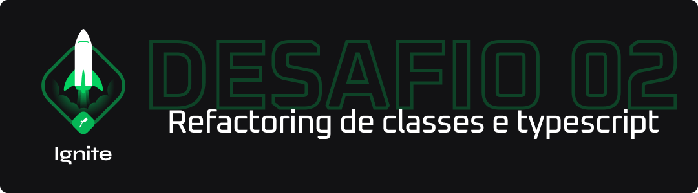

<p align="center">
  
</p>

## 💻 Detalhes do Desafio

Nesse desafio, você deverá criar uma aplicação para treinar o que aprendeu até agora no ReactJS

Essa será uma aplicação já funcional onde o seu principal objetivo é realizar dois processos de migração: de **Javascript** para **Typescript** e de **Class Components** para **Function Components**.

Para mais detalhes, [acesse a nota criada no Notion](https://www.notion.so/Desafio-02-Refactoring-de-classes-e-typescript-4571541e7f8c4799bd191b6cfb53802c).

## 📥 Instalação e execução

Faça um clone desse repositório e acesse o diretório.

```bash
$ git clone git@github.com:LeeonardoVargas/ignite-desafio-02-bonus.git && cd ignite-desafio-02-bonus

# Instalando as dependências
$ yarn

# Executanto o JSON Server
$ yarn server

# Executanto aplicação
$ yarn start
```
